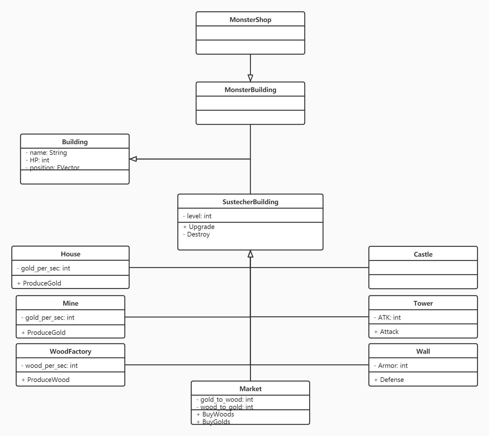

# Project SAM: SUSTecher And Monster
### Project part A report
### Member: 11812301 王浩, 11811408 李昶 11811410 李奇隆
## **Project Abstract**
Inspired by the one of the most classical and famous player-made game map *Troll and Elves* from *WarCraft 3*, we plan to develop a "Tower Defense" game that inherits some of the interesting and exciting features of it, and, on top of that, includes more fancy and fantastic functionalities along with additional interaction between players that share a same side or play as opponents to exploit more fun out of it. The basic and also the key game mode of our game would be a online, multi-player and imbalanced combat game also known as Asymmetric Battle Arena Game. Players would be divided into two sides. While one of them play as "Monster" to attack, the others act as "SUSTech" to build **tower** and walls to defend themselves from "Monster". To achieve that, a fairly good understanding about the APIs of the game engine--unreal that we are going to adopt is critical and vital. Moreover, the game experience largely depends on our design and understanding of network synchronization.
## **Description**
* Motivation
  * What's the problem?
  * What's your vision for solving the problem?
  * What's your solution
* Feature Description 
  * 2-4 user stories
  * UML use cases (Graph Done, description TODO)
* Requirements
  * Functional Requirements
  * Performance
    * network
    * Graphics
* Design Document
  * Class Diagrams
    * Player
      

         
      

      **Class Player**
      > User can choose one of the Player to play in game \
      > Move:  Move Player to where right-click event is generated \
      > UseSkill: Use a specific skill on a selected target

      **Class Sustecher** 
      > Can have multiple Sustechers in one game \
      > Build: Building a specific building on where left-click event is generated

      **Class Monster**
      > Only one in each game \
      > Attack: Dealing damage to a Sustecher or a SustecherBuilding and will give monster an amount of gold according to the magnitude of damage
        
    * Building
      

         
      

      **Class SustecherBuilding**
      > The buildings that Sustecher can build and monster can attack \
      > Upgrade: Raise the level of the building by 1 \
      > Destory: Destory the building

      **Class House**
      > The most important building of Sustecher \
      > The only source of gold in the early stages of game \
      > ProduceGold: Give a specific amount of gold to Sustecher

      **Class Mine**
      > The building that give major gold resource to Sustecher in the mid to last stages of game \
      > ProduceGold: Give a specific amount of gold to Sustecher

      **Class WoodFactory**
      > The building that give major wood resource to Sustecher in the mid to last stages of game \
      > ProduceWood: Give a specific amount of wood to Sustecher

      **Class Market**
      > The only way that Sustecher can get wood resource in the early stages of game \
      > BuyWoods: Give Sustecher an amount of wood by taking an amount of gold from Sustecher \
      > BuyGolds: Give Sustecher an amount of gold by taking an amount of wood from Sustecher

      **Class Castle**
      > Some high-level buildings can be built only after this building being built

      **Class Tower**
      > The major building that Sustecher used to attack the monster \
      > Attack: Dealing damage to a monster

      **Class Wall**
      > The major building that Sustecher used to defense the attack of monster \
      > Defense: Reduce the incoming damage by a certain percentage

      **Class MonsterBuilding**
      > The building that monster can interact with \
      > Be built in the beginning of the game \
      > Cannot be destoryed
      
      **Class MonsterShop**
      > The building where monster can use gold to buy equipments to improve itself

    * Skill
      

         
      

      **Class Skill**
      > ApplyTo: Apply a selected skill on a selected target

      **Class Enwind**
      > Limit the monster's movement for a few seconds

      **Class Silence**
      > Keep the monster from using its skills for a few seconds

      **Class Undamageable**
      > Keep the SustecherBuilding from being destroyed by the monster

      **Class Repair**
      > Sustecher can repair the HP of SustecherBuilding in a certain speed

      **Class DetectMap**
      > Make an area become visible to the monster for a few seconds

      **Class BackHome**
      > After casting for a few seconds, monster can teleport to a place near the MonsterShop

      **Class Hiding**
      > Keep the monster from being detected by a Sustecher or a SustecherBuilding for a few seconds

* Feasibility
  * Why your can achieve it?
  * Or how?

